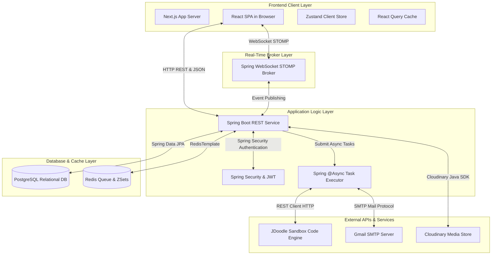
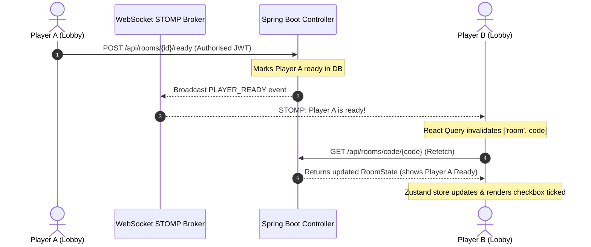
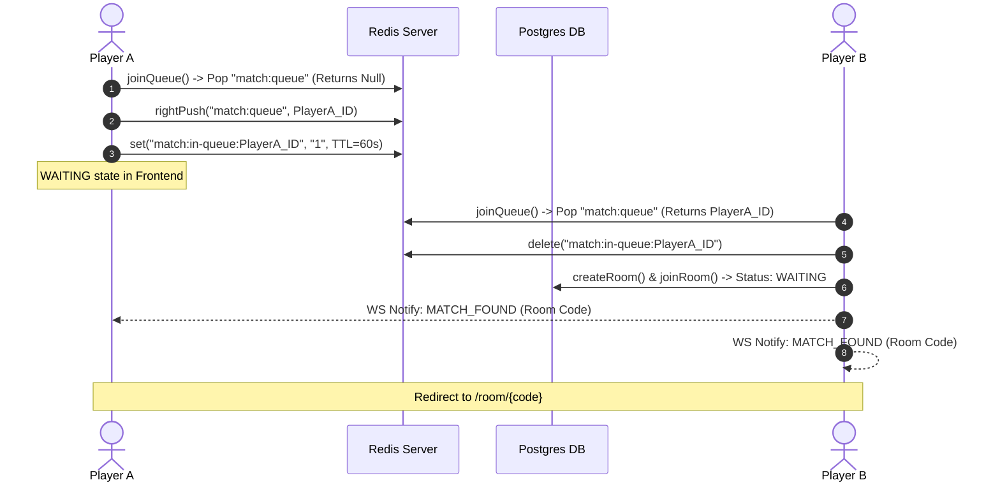

# CodeBattle ⚔️

CodeBattle is a premium, real-time competitive coding platform that pits developers against each other in fast-paced coding duels. Players can match up in rank-based duels, initialize custom private battle rooms with duration presets and specific problem search filters, and spectate ongoing matches in real-time.

---

## 🌟 Features

*   **Real-time Matchmaking:** Queue up and get paired with opponents of similar ELO ratings using a Redis-backed queue system.
*   **Custom Room Setup:** Create private rooms with custom battle durations (`15M`, `30M`, `45M`, `60M`) and choice of problems (specific selected problem or random fallback).
*   **Interactive Code Workspace:** Solve problems inside a sleek code editor supporting Java, Python, C++, C, and JavaScript, with real-time test case verification.
*   **Spectator Mode:** Join ongoing matches to watch developers code and submit in real-time.
*   **Dynamic Leaderboards:** Real-time global and weekly rankings powered by Redis Sorted Sets (ZSets), plus friends-only filter support.
*   **Streaks & Achievements:** Earn XP, build coding streaks, and unlock unique milestones like "Speed Demon" or "Hard Solver".
*   **Email Notifications:** Automatic emails for password resets, registration verification, and post-match performance reports.

---

## 🏗️ System Architecture

CodeBattle is designed around a modern decoupled architecture consisting of a React client, a Spring Boot REST API, a Redis cache & message broker, a PostgreSQL relational database, and an external code execution engine.

### 1. Component Deployment Topology

This diagram describes the physical and logical layers of the CodeBattle stack, showcasing how components communicate across boundaries.



---

## 📐 System Design Details

### 1. Real-Time State Synchronization (STOMP WebSockets)
Real-time duplex communication is established using **SockJS** and the **STOMP (Simple Text Oriented Messaging Protocol)** message broker built into Spring Boot.

#### Socket Authentication Lifecycle
*   **Interception:** During the initial WebSocket handshake, the `WebSocketAuthInterceptor` extracts the JWT Bearer token from the handshake header.
*   **Validation & Principal Injection:** The interceptor validates the token via `JwtUtil`. If valid, it injects the user's details as the socket session's `Principal`, establishing secure stateful channel identification.
*   **Subscription Handshake:** Clients subscribe to room topics `/topic/room/{roomId}` and match topics `/topic/match/{roomId}`. The server authenticates every subscription frame to prevent spectators or malicious users from spying on private channels.

#### Client Cache Invalidation Pipeline
Zustand handles local transient UI states, whereas React Query caches backend data. When a STOMP event is received, React Query invalidates cached keys, forcing silent background refetches.



### 2. Redis-Backed Matchmaking Queue
Matchmaking uses a Redis List (`match:queue`) as a FIFO queue, combined with Redis String markers to ensure atomic user states.

#### Core Flow:
1.  **Queue Entry:** A user calls `POST /api/match/random`.
2.  **State Check:** The system verifies if the user is already in the queue by checking `match:in-queue:{userId}` to prevent double queues.
3.  **Atomic Dequeue Attempt:** The backend calls `redisTemplate.opsForList().leftPop("match:queue")`.
    *   **Case A (Queue Empty):** If `leftPop` returns null, the current user is pushed to the queue (`rightPush("match:queue", userId)`) and a TTL marker of 60 seconds is set on `match:in-queue:{userId}`.
    *   **Case B (Opponent Found):** If `leftPop` returns an opponent's ID, the queue marker is cleared, a room is created in the database (`RoomStatus.CREATED`), the opponent is auto-joined (`RoomStatus.WAITING`), and a `MATCH_FOUND` notification is pushed to both players.



### 3. Asynchronous Code Execution & Sandbox Grading
Code execution cannot happen on the main request threads because compilation and remote evaluation take seconds, which would starve the servlet container.

#### Grading Execution Flow:
1.  **REST Handoff:** The client submits code through `POST /api/submissions`. The backend performs authorization checks and inserts a `Submission` entity with `PENDING` status.
2.  **Async Thread Dispatch:** The request thread dispatches the execution task to Spring’s TaskExecutor (annotated with `@Async`) and returns a HTTP `202 ACCEPTED` status immediately to the client.
3.  **Grading Execution:** The async thread runs `runJudgeAsync(...)`. It iterates through all test cases associated with the problem and posts compile requests to the **JDoodle Sandbox REST API**.
4.  **Verification Loop:**
    *   If a test case fails, output checking is aborted, and the final state is set to `WRONG_ANSWER`.
    *   If JDoodle returns memory or CPU resource violations, it sets the status to `TIME_LIMIT_EXCEEDED` or `MEMORY_LIMIT_EXCEEDED`.
    *   If compile errors exist, the output is captured as the `errorMessage` and set to `COMPILE_ERROR`.
    *   If all test cases match perfectly, the status is set to `ACCEPTED`.
5.  **Status Sync:** The execution thread invokes `updateStatus` through a transactional proxy wrapper. It persists results to the database and broadcasts the `SUBMISSION_RESULT` to the room via WebSockets.

```mermaid
flowchart TD
    Submit[Client submits Code] -->|POST /api/submissions| Controller[REST Controller]
    Controller -->|Save PENDING Submission| DB[(PostgreSQL)]
    Controller -->|Dispatch Task| TaskExecutor[@Async Task Executor Thread]
    Controller -->|Return HTTP 202| Client[React Client UI]
    TaskExecutor -->|Fetch Test Cases| DB
    TaskExecutor --> Loop[Iterate Test Case]
    Loop -->|Execute Code| JDoodle[JDoodle Sandbox REST API]
    JDoodle --> Result{Result OK?}
    Result -->|Compile Error| SetCompile[Status: COMPILE_ERROR]
    Result -->|Runtime Error| SetRuntime[Status: RUNTIME_ERROR]
    Result -->|TLE / MLE| SetResource[Status: TLE or MLE]
    Result -->|Output Mismatch| SetWA[Status: WRONG_ANSWER]
    Result -->|Output Matches| Next{More Test Cases?}
    Next -->|Yes| Loop
    Next -->|No| SetAccepted[Status: ACCEPTED]
    SetCompile & SetRuntime & SetResource & SetWA & SetAccepted --> SaveStatus[Save status to DB]
    SaveStatus --> Broadcast[WS Broadcast: SUBMISSION_RESULT]
```

### 4. ELO Rating Calculation & Game Theory
When a match ends (either because a player achieves an `ACCEPTED` submission first, or the match timer expires), ELO ratings are updated using the standard Elo Rating System formulas.

#### Step A: Probability of Winning (Expected Score)
Let $R_A$ be the current rating of Player A, and $R_B$ be the rating of Player B. The expected score (winning probability) $E_A$ for Player A is:

$$E_A = \frac{1}{1 + 10^{(R_B - R_A)/400}}$$

Similarly, the expected score $E_B$ for Player B is:

$$E_B = \frac{1}{1 + 10^{(R_A - R_B)/400}}$$

#### Step B: Rating Update
After the winner is determined:
*   The actual score $S$ is $1.0$ for the winner, and $0.0$ for the loser.
*   The new rating $R'$ is calculated using a constant factor $K = 32$:

$$R'_A = R_A + K \cdot (S_A - E_A)$$

$$R'_B = R_B + K \cdot (S_B - E_B)$$

*   Ratings are capped at a minimum floor of $100$ to prevent negative progression.

---

## 💻 Tech Stack

| Layer | Technology | Purpose |
| :--- | :--- | :--- |
| **Frontend** | Next.js (App Router), React, TypeScript | Core web application framework |
| | React Query | Server state synchronization & cache invalidation |
| | Zustand | Client state management (lobby, active room) |
| | SockJS & StompJS | Real-time WebSocket communication client |
| | Tailwind CSS | Sleek, glassmorphic dark-theme UI |
| **Backend** | Spring Boot, Spring Security | Core backend engine and API controller |
| | Spring WebSockets, STOMP | Real-time event broadcasting |
| | Spring Data JPA, Hibernate | Database Object Relational Mapping (ORM) |
| **Databases**| PostgreSQL | Relational storage for users, problems, submissions |
| | Redis | Matchmaking queue, leaderboard caching, and rankings |
| **Execution**| JDoodle REST API | Sandbox code execution and grading engine |
| **Third-Party**| Gmail SMTP | Security verification and notification mails |
| | Cloudinary | User avatar image hosting |

---

## 🛠️ Prerequisites

Ensure you have the following installed on your local environment:
*   **Java JDK 17** or higher
*   **Node.js 18.x** or higher (with `npm`)
*   **PostgreSQL 14+** (running locally or in the cloud)
*   **Redis Server** (running locally or via Redis Labs)
*   **Maven 3.x** (or use the included wrapper `./mvnw`)

---

## 🚀 Getting Started

### 1. Server Configuration (Backend)

Navigate to the `server` directory:
```bash
cd server
```

Create a `.env.local` or edit the `.env` file in the root of the server directory with your credentials:
```properties
# Database Config
DATABASE_URL=jdbc:postgresql://localhost:5432/codebattle
SPRING_DATASOURCE_USERNAME=postgres
SPRING_DATASOURCE_PASSWORD=your_password

# Redis Config
REDIS_URL=redis://localhost:6379

# JWT Config
JWT_SECRET=your_super_secret_jwt_key_at_least_256_bits

# Email Configuration
GMAIL_USER=your_gmail@gmail.com
GMAIL_APP_PASSWORD=your_app_specific_password

# OAuth2 Credentials (Optional for Social Login)
GOOGLE_CLIENT_ID=your_google_client_id
GOOGLE_CLIENT_SECRET=your_google_client_secret
GITHUB_CLIENT_ID=your_github_client_id
GITHUB_CLIENT_SECRET=your_github_client_secret

# Third-Party Integrations
CLOUDINARY_CLOUD_NAME=your_cloudinary_name
CLOUDINARY_API_KEY=your_cloudinary_key
CLOUDINARY_API_SECRET=your_cloudinary_secret
JDOODLE_CLIENT_ID=your_jdoodle_client_id
JDOODLE_CLIENT_SECRET=your_jdoodle_client_secret
```

Build and run the Spring Boot application:
```bash
# Using Maven wrapper
./mvnw spring-boot:run
```
The server will boot on `http://localhost:8080`. Database seeding (`ProblemSeeder.java`) will automatically initialize 10 standard coding problems if the database is empty.

### 2. Client Configuration (Frontend)

Navigate to the `client` directory:
```bash
cd ../client
```

Create a `.env` file in the root of the client directory:
```env
NEXT_PUBLIC_API_URL=http://localhost:8080
NEXT_PUBLIC_WS_URL=http://localhost:8080/ws
```

Install dependencies and start the development server:
```bash
npm install
npm run dev
```
The client will start on `http://localhost:3000`.

---

## 📡 WebSockets & STOMP Channels

CodeBattle uses WebSocket STOMP topics to exchange real-time updates. Below are the key channels:

### Subscription Topics (Client-Side)
*   `/topic/room/{roomId}`: Receives room-specific events (`OPPONENT_JOINED`, `PLAYER_READY`, `MATCH_STARTED`, `MATCH_ENDED`, `ROOM_CLOSED`).
*   `/topic/match/{roomId}`: Receives code execution updates (`SUBMISSION_RUNNING`, `SUBMISSION_RESULT`).
*   `/user/queue/notifications`: Receives personal notifications (e.g. `MATCH_FOUND`, `CHALLENGE_RECEIVED`).

### Destination Topics (Client to Server)
*   `/app/room/{roomId}/ping`: Sends lobby connection status updates.
*   `/app/room/{roomId}/typing`: Sends player code typing notifications to their opponent.

---

## 🗄️ Database Schema & Entities

The relational database consists of the following key JPA entities:

*   **User:** Stores username, email, ELO rating, XP, streak, achievements, and credential records.
*   **Room:** Configures the lobby state (code, creator, opponent, status, duration, selected problem, winner, started/ended timestamps).
*   **Problem:** Defines the title, description, difficulty (`EASY`, `MEDIUM`, `HARD`), topic, constraints, limits, and associated test cases.
*   **TestCase:** Contains test inputs, expected outputs, and visibility status (hidden vs sample examples).
*   **Submission:** Logs every user submission including the source code, target language, compilation results, resource metrics (time/memory), and execution error details.

---

## 🧑‍💻 Developer Guidelines

1.  **State Management Guidelines:**
    *   Use **Zustand** stores (`client/src/store`) strictly for client-side UI configurations (e.g. editor theme, active editor code, layout toggles).
    *   Use **React Query** queries & mutations for server-bound state. Invalidate keys sequentially (`["room"]`, `["problems"]`) to keep the UI in sync.
2.  **Spring Boot Transactions:**
    *   Always verify Spring's AOP proxy behaviour. Do not invoke `@Transactional` methods internally (same-class self-invocation) without routing through a self-injected proxy bean, otherwise Hibernate sessions will close early and throw `LazyInitializationException` on lazy associations.
3.  **Code Styling:**
    *   Maintain the premium cyberpunk glassmorphism dark mode theme. Utilize Tailwind utility classes but fallback to base style sheets (`globals.css`) for core custom component styling (e.g. `.cb-card`, `.cb-input`, `.btn-primary`).
